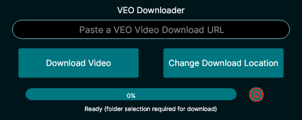
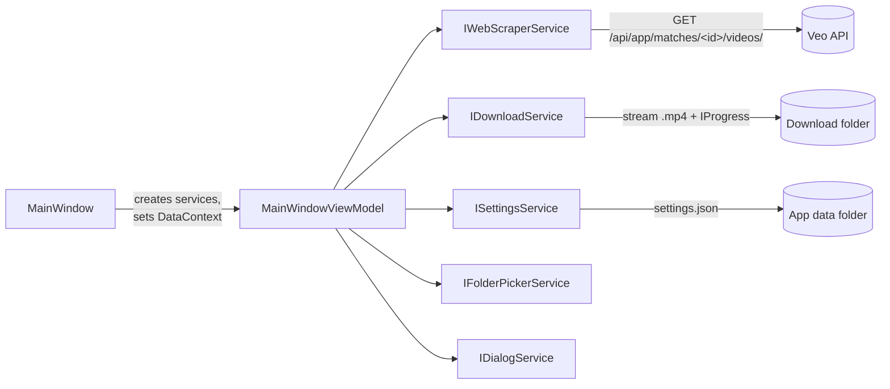

# Veo Downloader (C# / .NET)

A cross-platform .NET 10 / Avalonia desktop app that takes a Veo match URL and downloads the full match recording as an `.mp4`.


<sub>Screenshot: Linux build, idle state.</sub>

> I built this app twice to compare the two languages: first in [**veo-downloader-cpp**](https://github.com/amcnutt1996/veo-downloader-cpp) (C++/Qt), then this C#/.NET rewrite (Jan – Feb 2026).

> **Note:** This tool is meant for downloading recordings you already have access to on Veo.

## What it does
- Paste an `app.veo.co/matches/...` link, and the app resolves the underlying video file and downloads it.
- Streams the download with a live progress bar and status text.
- Remembers your chosen download folder between launches.
- Runs on Windows, macOS and Linux from one codebase (Avalonia).

## Tech stack
C# · .NET 10 · Avalonia 11 (Fluent theme) · CommunityToolkit.Mvvm · MessageBox.Avalonia · `HttpClient` · System.Text.Json

## How it works



- **MVVM with source generators:** `[ObservableProperty]` and `[RelayCommand]` (CommunityToolkit.Mvvm) generate the bindable properties and commands, so the view model has no hand-written `INotifyPropertyChanged` boilerplate.
- **Interface-based services with constructor injection:** scraping, downloading, settings, folder picking and dialogs each sit behind an interface. `MainWindow` acts as the composition root and passes them into the view model, which never touches UI or platform APIs directly. A separate design-time constructor feeds the XAML previewer.
- **One shared `HttpClient`** for the scraper and downloader. It's disposed when the window closes.
- **Async streamed download:** `HttpCompletionOption.ResponseHeadersRead` starts reading before the whole body arrives. The file is copied in 80 KB chunks, and progress is reported through `IProgress<double>`, which marshals updates back to the UI thread.
- **Persisted settings:** the chosen folder is saved to `settings.json` under the OS app data folder (`Environment.SpecialFolder.ApplicationData`) and cached in memory after the first load.

## Build & run

Requires the [.NET 10 SDK](https://dotnet.microsoft.com/download/dotnet/10.0).

```bash
dotnet run --project VEOVideoDownloader.csproj
```

For a release build: `dotnet build -c Release`.

## Challenges & what I learned
- **Translating Qt patterns to MVVM:** Qt's signals/slots became observable properties, relay commands and `IProgress<T>`. Putting logic in the view model made the UI layer much thinner than in the C++ version.
- **Separation of concerns:** splitting every side effect (HTTP, file system, dialogs) behind an interface was the biggest structural change from the C++ app.
- **Simplifying the scrape:** the C++ version fetches the match page to find the API URL. Here I build the API URL straight from the match URL, which saves a round trip.
- **Cross-platform file access:** downloads go through Avalonia's `IStorageFolder`/`StorageProvider`, with a fallback that re-prompts for a folder if the OS denies access.

**Known limitations / next steps:** cancelling a download is still a TODO in the view model. Download errors are logged to the console rather than shown in the UI.

## Related
- [veo-downloader-cpp](https://github.com/amcnutt1996/veo-downloader-cpp): the same app in C++20 / Qt 6

| | **C++** | **C# (this repo)** |
|---|---|---|
| UI | Qt 6 Widgets (`.ui` designer file) | Avalonia 11 XAML, MVVM (CommunityToolkit.Mvvm) |
| Link resolution | libcurl, 2 requests (match page → API) | `HttpClient`, async; builds the API URL from the match URL (1 request) |
| Download | `QNetworkAccessManager` signals/slots | `HttpClient` stream copy with `IProgress<double>` |
| Partial files | `.part` → renamed on success | Writes the final file directly |
| Cancel | Stop button + `Esc` | Not yet (TODO) |
| Settings | Downloads folder default, picker per session | Save folder persisted to JSON in the app data folder |
| Structure | 3 classes: window, scraper, downloader | Interface-based services passed in through constructors |
| Build / ship | CMake + vcpkg; macOS `.app`, static x86_64 | `dotnet` CLI; cross-platform (Windows/macOS/Linux) |

## License
[MIT](LICENSE)
